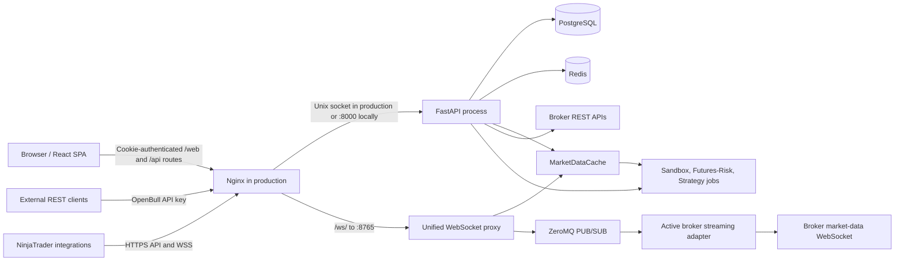
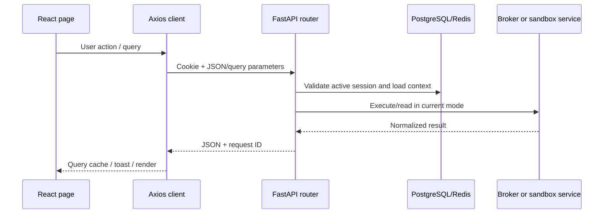

# 2. System Architecture

## High-level topology

In local development, Vite serves the SPA on port 5173 and proxies API requests to FastAPI on port 8000. FastAPI starts the market-data WebSocket proxy in-process on port 8765. Production nginx serves the built SPA, proxies API traffic to the systemd-managed FastAPI Unix socket, and proxies `/ws/` to port 8765.

## Application layers

| Layer | Source | Responsibility |
|---|---|---|
| Presentation | `frontend/src/pages`, `components` | Routes, forms, tables, charts, user feedback |
| Frontend data | `frontend/src/api`, `contexts`, `hooks` | Axios calls, TanStack Query cache, auth/mode/theme, WebSocket subscriptions |
| HTTP transport | `backend/routers`, `backend/api` | Cookie web endpoints and API-key external endpoints |
| Business services | `backend/services`, `futures_risk`, `strategy`, `sandbox` | Validation, broker-neutral operations, analytics, execution and lifecycle rules |
| Broker adapters | `backend/broker/<name>` | Provider auth, mapping, REST calls, master contract, streaming |
| Streaming | `backend/websocket_proxy`, `MarketDataCache`, ZeroMQ | Subscription pooling, broker stream normalization, tick fanout, internal latest-price cache |
| Persistence | SQLAlchemy models, Alembic, PostgreSQL | Users, configuration, sessions, logs, strategies, sandbox, futures-risk, symbols |
| Cache | Redis and process-local caches | Broker/API contexts, symbol/token maps, throttling, latest ticks/fallback state |
| Operations | `install.sh`, `install/`, logging utilities | Deployment, service management, nginx/TLS, performance tuning, bounded logging |

## Startup sequence

`backend/main.py` defines one FastAPI lifespan. The verified order is:

1. Connect to PostgreSQL and create missing ORM tables.
2. Run idempotent startup micro-migrations.
3. Start the queued API-log writer.
4. Seed and reconcile sandbox state; start sandbox execution, scheduler, and MTM workers.
5. Seed futures-risk defaults and start its auto-exit engine.
6. Register event-bus audit and broadcast subscribers.
7. Recover active strategy runs; start tick processor/feed, checkpoint loop, and scheduler.
8. Load broker plugins.
9. Hydrate in-process symbol maps from PostgreSQL.
10. Start the WebSocket proxy on the configured host/port.

Shutdown reverses streaming and worker lifecycles, drains the API-log writer, closes shared HTTP/Redis clients, and disposes the database engine.

## Primary request flows

### Browser request

### External API request

The request body carries the OpenBull `apikey`. The dependency verifies its Argon2 hash, resolves user and non-revoked broker authentication, decrypts the broker token/configuration, and dispatches the operation through live or sandbox services.

### Live market-data flow

See [the WebSocket architecture](../06-api-websocket/websocket-protocol.md). A browser or integration authenticates with an OpenBull API key, the proxy creates/reuses one credential-matched broker adapter, pools symbol demand, publishes normalized ticks, updates `MarketDataCache`, and fans data to subscribed clients.

## Process and scaling constraints

- The WebSocket proxy and several process-local engines/caches are started inside the FastAPI process.
- The production service intentionally uses one Uvicorn worker because multiple workers would each attempt to bind port 8765 and would hold divergent process-local market caches/background engines.
- Horizontal scaling requires extracting WebSocket ownership and singleton jobs or introducing explicit leader election; it is not provided by the current deployment scripts.
- Redis is a cache/fallback accelerator, not the primary database. PostgreSQL remains the durable source of truth.

## Directory guide

See [folder and file structure](folder-structure.md) and the generated inventories for exact current routes and tables.
