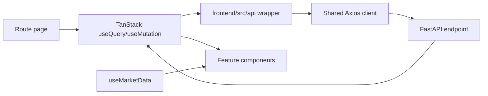

# Frontend Components and Data Flow

## Route-to-data pattern

Most pages follow this sequence:

Pages own route-level filtering, query keys, mutations, and navigation. Feature components own presentation and local interaction. Shared UI primitives do not call backend APIs directly.

## Error and loading behavior

- Protected-route session validation renders no blocking full-screen loader while the short auth query resolves.
- Lazy-route fallback is intentionally empty because authenticated chunks are preloaded.
- Server errors are normally surfaced through Sonner toasts or page-level error states.
- The Axios interceptor handles expired application sessions and structured broker issues globally.
- Market-data errors reconnect automatically; broker action is surfaced when credentials/subscription state requires a user.

## Live/sandbox separation

Trading mode is global. Switching mode updates the backend then invalidates order, trade, position, holding, funds, dashboard, and futures-risk query families. Components must not reuse live values after switching to sandbox or vice versa.

## Form conventions

- Password/secret inputs use the shared password component when available and must not echo saved secrets from the server.
- Broker credential forms may submit blank secret fields to preserve encrypted saved values only when the backend explicitly implements that behavior.
- Trading forms must use normalized OpenBull symbols, supported exchange/product/price-type values, positive quantities, and provider-specific tick rounding supplied by the relevant page/service.
- Server validation remains authoritative; client validation is for early feedback.
