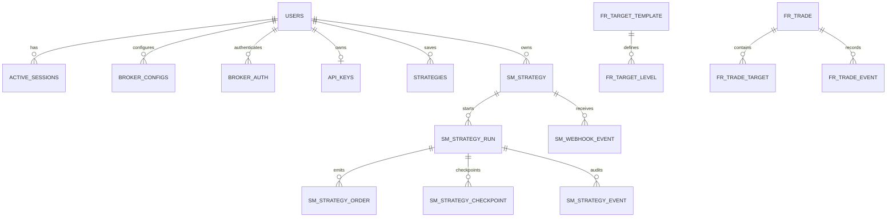

# 5. Database Documentation

## Platform

OpenBull uses PostgreSQL through SQLAlchemy 2.0. FastAPI request paths use `asyncpg`; selected synchronous/background utilities use the derived psycopg URL. Redis is not a durable database.

The generated [database schema inventory](../inventories/database-schema.md) lists all current ORM tables, columns, types, defaults, constraints, indexes, and foreign keys.

## Domain groups

| Domain | Tables |
|---|---|
| Identity and security | `users`, `active_sessions`, `login_attempts`, `broker_configs`, `broker_auth`, `api_keys` |
| Audit/operations | `error_logs`, `api_logs`, `app_settings` |
| Reference data | `symtoken` |
| Sandbox | `sandbox_orders`, `sandbox_trades`, `sandbox_positions`, `sandbox_holdings`, `sandbox_funds`, `sandbox_config`, `sandbox_daily_pnl` |
| Saved strategy designs | `strategies` |
| Strategy lifecycle module | `sm_strategy`, `sm_strategy_run`, `sm_strategy_order`, `sm_strategy_checkpoint`, `sm_webhook_event`, `sm_strategy_event` |
| Futures risk | `fr_config`, `fr_target_template`, `fr_target_level`, `fr_symbol_map`, `fr_trade`, `fr_trade_target`, `fr_trade_event` |

## Relationship overview

Sandbox records use user identifiers and normalized broker/order fields but not every ownership link is expressed as an ORM foreign key. Consult the generated schema before assuming cascade behavior.

## Migration strategy

`migrate_all.py` orchestrates table creation, startup-compatible schema adjustments, and `alembic upgrade head`. The application also runs idempotent micro-migrations at startup for compatibility with existing deployments. New schema changes should use an Alembic revision; startup migrations are for narrow compatibility cases and must remain idempotent.

## Data ownership and retention

- Broker credentials and auth tokens are encrypted before persistence.
- Passwords and API keys are stored as hashes; API keys also have encrypted recovery storage for the owning user.
- Strategies and broker context are user-scoped.
- API/error log row counts are bounded by settings and background writers.
- Symbol data is replaceable reference data refreshed from brokers.
- Sandbox, futures-risk, and strategy records are business state and must be included in backups.

See [backup and restore](../11-deployment-operations/backup-restore.md).
