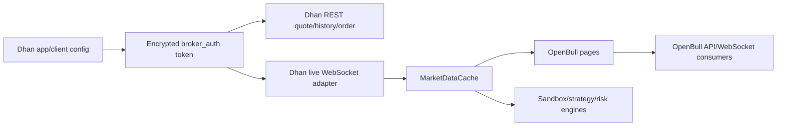

# Dhan Integration

## Configuration paths

The current source supports two Dhan authentication paths.

### Partner consent

Broker Configuration displays:

- Dhan Client ID
- App ID (API Key)
- App Secret
- Redirect URL

After saving, Select Broker → Login with Dhan API generates the provider consent URL and completes at `/dhan/callback`.

### Access-token login

Select Broker → Connect with access token opens `/broker/dhan/token`. The request sends the Dhan Client ID and full access token to `POST /auth/dhan/token-login`; OpenBull saves the active token encrypted and preserves the client ID required by Dhan REST/streaming.

## Data flow

The OpenBull API key used by NinjaTrader/browser WebSocket clients only authenticates them to OpenBull. It is never a substitute for the Dhan access token.

## Required external state

- Valid Dhan client ID and current access token/consent.
- Dhan data subscription/entitlement for market data.
- Enabled exchange/trading segments for requested instruments.
- Symbol present in the current Dhan master contract and mapped to its security ID/segment.
- Market session or a REST endpoint capable of returning the last snapshot when no new tick is occurring.

## Verified diagnostic messages

| Symptom/message | Meaning/action |
|---|---|
| Invalid/expired client ID or access token | Re-authenticate; do not repeatedly retry the same rejected token |
| Data API access/subscription unavailable | Enable/renew Dhan market-data entitlement |
| 429 or Dhan connection/rate-limit code | Reduce duplicate REST/WS demand and wait for provider backoff |
| WebSocket connected but no ticks | Verify subscription acknowledgement, exact symbol/segment/security ID, market session, and data entitlement |
| Both web and NinjaTrader stop together | Diagnose the shared OpenBull↔Dhan token/adapter/cache path before treating them as independent UI defects |

## Security

Do not include Dhan client IDs, tokens, app secrets, consent codes, or live security/account data in screenshots or logs. Revoke exposed values through Dhan and rotate any affected OpenBull API key separately.
